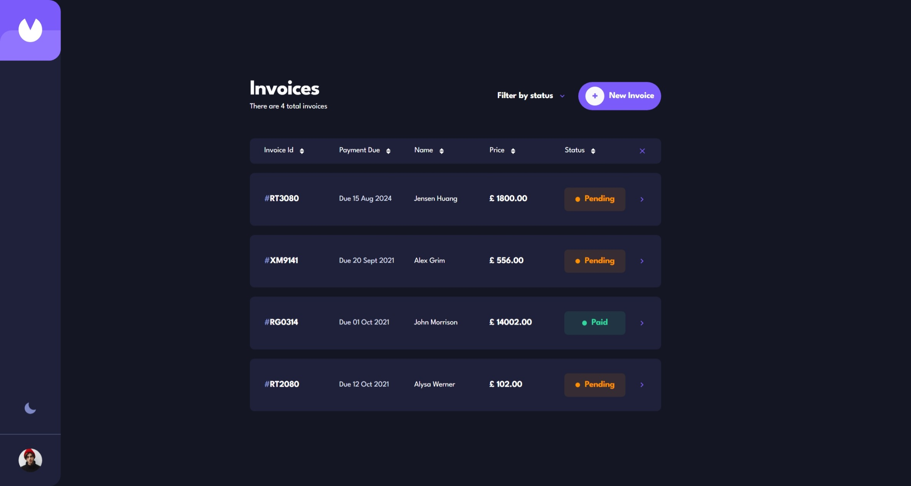
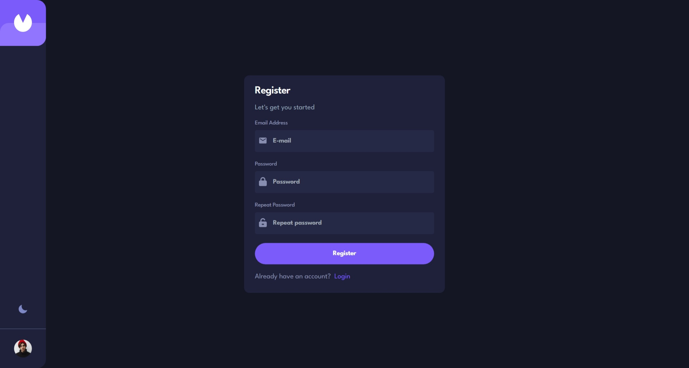
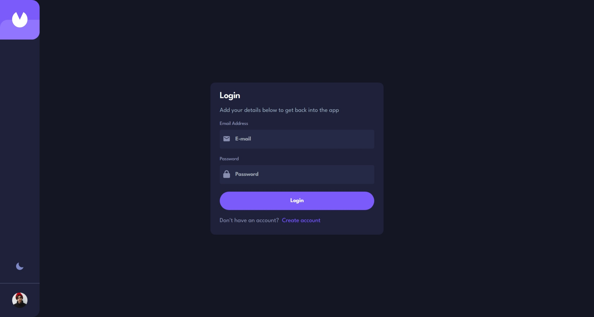
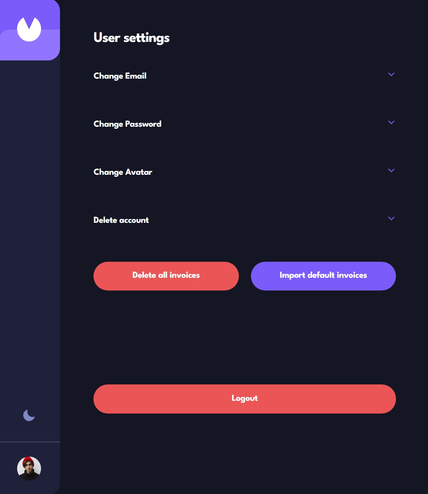
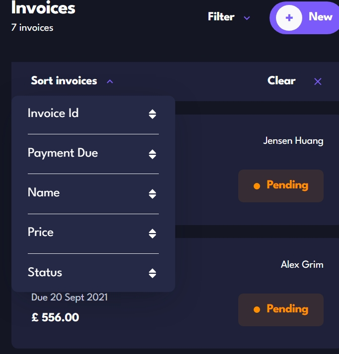
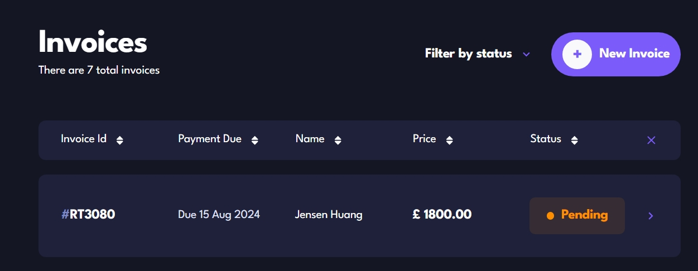

# Frontend Mentor - Invoice app solution

This is a solution to the [Invoice app challenge on Frontend Mentor](https://www.frontendmentor.io/challenges/invoice-app-i7KaLTQjl). Frontend Mentor challenges help you improve your coding skills by building realistic projects.

## Table of contents

- [Frontend Mentor - Invoice app solution](#frontend-mentor---invoice-app-solution)
  - [Table of contents](#table-of-contents)
  - [Overview](#overview)
    - [The challenge](#the-challenge)
    - [Screenshot](#screenshot)
    - [Links](#links)
  - [My process](#my-process)
    - [Built with](#built-with)
    - [What I learned](#what-i-learned)
      - [Application structure](#application-structure)
      - [Next Auth](#next-auth)
      - [Prisma](#prisma)
      - [Sort bar](#sort-bar)
      - [Shadcn/ui](#shadcnui)
    - [Continued development](#continued-development)
    - [Useful resources](#useful-resources)
  - [Author](#author)

## Overview

### The challenge

Users should be able to:

- View the optimal layout for the app depending on their device's screen size
- See hover states for all interactive elements on the page
- Create, read, update, and delete invoices
- Receive form validations when trying to create/edit an invoice
- Save draft invoices, and mark pending invoices as paid
- Filter invoices by status (draft/pending/paid)
- Toggle light and dark mode
- **Bonus**: Keep track of any changes, even after refreshing the browser (`localStorage` could be used for this if you're not building out a full-stack app)

### Screenshot



### Links

- Solution URL: [https://github.com/kamiliano1/invoice-application](https://github.com/kamiliano1/invoice-application)
- Live Site URL: [https://invoice-application-eight.vercel.app](https://invoice-application-eight.vercel.app)

## My process

### Built with

- Semantic HTML5 markup
- Flexbox
- CSS Grid
- Mobile-first workflow
- [React](https://reactjs.org/) - JS library
- [Next.js](https://nextjs.org/) - React framework
- [TailwindCSS](https://tailwindcss.com/)
- [React Recoil](https://recoiljs.org/)
- [React hooks form](https://react-hook-form.com/)
- [next-auth](https://authjs.dev/)
- [zod](https://zod.dev/)
- [radix-ui](https://www.radix-ui.com/)
- [shadcn/ui](https://ui.shadcn.com/)
- [prisma](https://www.prisma.io/)

### What I learned

#### Application structure

The application integrates the login, registration, main, and preview pages into a unified interface. Both the main and preview pages utilize the Suspense component to enhance user experience by managing loading states while connecting to the database.

```js
 <Suspense fallback={<Skeleton className="h-[18px] w-30" />}>

```

Use client is only using on the part that are required user interactions like form buttons

#### Next Auth

With NextAuth, users can log in using their email address and password. Their credentials and associated information are securely stored in the database.

#### Prisma

This was my first experience working with Prisma to develop a full-stack application using MongoDB as the database provider.

Account Creation
To create an account, users are required to provide an email address and a password. However, the system does not send any verification token or link to the provided email address.

Login
On the login page, users can enter their credentials, which are securely stored in the database. The password is hashed using bcryptjs before storage.

User Account Management
Once logged in, users can manage their accounts by accessing the settings section, which is available by clicking on the avatar icon.


Available Actions:

- Change Email Address: Users can update their registered email address.
- Update Password: Users can change their password.
- Update Avatar: Users can upload or change their avatar.
- Invoice Management: Users can import invoices provided by Frontend Mentor.
- Account Deletion: Users have the option to delete all invoices or permanently delete their account. Please note that the deletion action is irreversible.

#### Sort bar

Users can sort invoices by various criteria, including ID, payment due date, client name, amount, and status. Additionally, users can filter invoices by status, allowing them to hide specific invoices as needed.

Mobile Sort bar


Tablet and Desktop Sort bar


#### Shadcn/ui

Shadcn/UI was instrumental in the design process, particularly in the implementation of form elements, whether for managing invoices or handling user credentials.

### Continued development

Tasks to do:

- [x] Sort bar
- [x] User register/login
- [x] User section
- [ ] Share invoice to other person
- [ ] Graph with spending
- [ ] Print invoice to PDF
- [ ] Import invoices from file

### Useful resources

Working with the Next Auth I've used [Next Auth V5 - Advanced Guide (2024)](https://www.youtube.com/watch?v=1MTyCvS05V4)

## Author

- Website - [Kamil Szymon](https://github.com/kamiliano1)
- Frontend Mentor - [@kamiliano1](https://www.frontendmentor.io/profile/kamiliano1)
- Twitter - [@k_p_szymon](https://twitter.com/k_p_szymon)
- Code Wars - [kamiliano1](https://www.codewars.com/users/kamiliano1)
